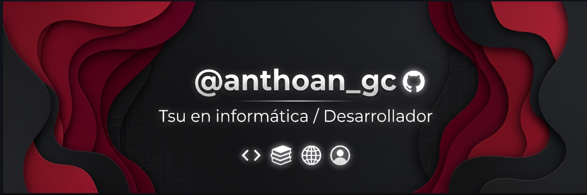

<h1 align="center">
  <b>Hola, soy Anthoan</b> 
  
</h1>

  

 

  
  &nbsp;&nbsp;
  
  &nbsp;&nbsp;
  

---

### 👤 Sobre mí

Soy Técnico Superior Universitario en Informática y estudiante de Ingeniería en la **UPTAEB**. Mi perfil abarca todo el proceso de ingeniería de software, combinando el desarrollo backend avanzado, el diseño de bases de datos relacionales y una visión integral del ciclo de desarrollo:

*   **Ciclo Completo:** Desde el análisis profundo de requerimientos funcionales hasta la arquitectura final.
*   **Garantía de Calidad (QA):** Aplicación de metodologías de pruebas rigurosas, incluyendo testing de **caja negra y caja blanca** para validar la lógica y la interfaz.
*   **Seguridad y Optimización:** Integración de auditorías de seguridad en el código, administración avanzada en entornos Linux, contenedorización y despliegues eficientes en la nube.

Mi objetivo es entregar software que no solo sea funcional, sino seguro, escalable y con altos estándares de calidad.

---

### <b> Tecnologías y Herramientas</b>

| Área | Tecnologías |
| :--- | :--- |
| **Backend & Lenguajes** |     |
| **Frontend** |    |
| **Bases de Datos** |   |
| **Cloud & DevOps** |     |

---

### 🌟 Proyectos Destacados

🔹 **Sistema de Gestión e Inventario Multi-tienda**
*   **Descripción:** Aplicación robusta orientada a la gestión de inventario retail. Implementa lógica compleja de backend, optimización de consultas SQL y manejo de sesiones.
*   **Stack:** Python (Flask), MySQL, MVC, Docker.

🔹 **Ecosistema de Gestión Digital Empresarial**
*   **Descripción:** Plataforma integral para la administración de talleres y servicios. Diseñada bajo contenedores Docker y desplegada con éxito en servidores virtuales en la nube.
*   **Stack:** Python (Flask), MySQL, Docker Compose, AWS (EC2/VPS).

🔹 **Catálogos Interactivos Web**
*   **Descripción:** Interfaces optimizadas y dinámicas para catálogos comerciales, enfocadas en un rendimiento fluido y una estructura de datos eficiente.
*   **Stack:** PHP, JavaScript, CSS3.

---

###  &nbsp;GitHub Analytics

---

⚡ *“El código limpio siempre parece que fue escrito por alguien a quien le importa”.*
